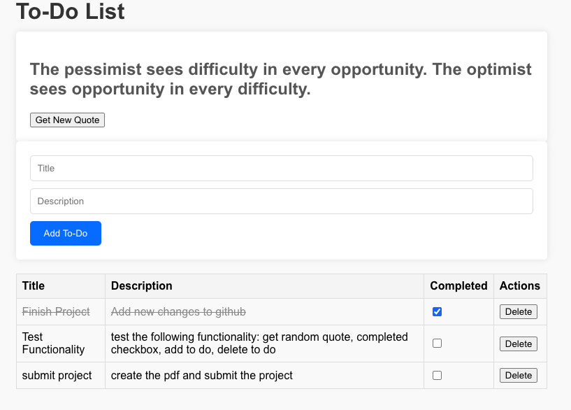

# Full Stack Sample Application

=====================================

### Overview

This is a full stack sample to do list application using React on the front end and Django on the backend to serve 2 different apis a todo api and a quote api.



### Features

- Create, Read, Update, Delete (CRUD) operations for todo items
- Display random quotes on the home page

### How to use locally

1. Clone the repository
2. Navigate to the project directory
3. **Install Backend Dependencies:**
   - From the root directory, activate the virtual environment:
     ```bash
     source venv/bin/activate
     ```
   - Install the required Python packages:
     ```bash
     pip install -r requirements.txt
     ```
4. create a .env file with `SECRET_KEY=your-secret-key`
5. run `python -c 'from django.core.management.utils import get_random_secret_key; print(get_random_secret_key())'` to get a key to replace `your-secret-key`
6. cd into the backend folder
7. type `python manage.py migrate` into the terminal from the backend folder

8. Run `python manage.py runserver` to start the Django development server
9. cd into the frontend folder
10. type `npm install` to install the required packages
11. type `npm start` to start the React development server
12. Open a web browser and navigate to `http://localhost:3000` to view the
    application
13. You can use the todo api by navigating to `http://localhost:8000/api/t
odo/` in your browser
14. You can use the quote api by navigating to `http://localhost:8000/api/
quote/` in your browser

### API Endpoints

#### Todo API

- `GET /api/todo/`: Returns a list of all todo items
- `POST /api/todo/`: Creates a new todo item
- `GET /api/todo/{id}/`: Returns a single todo item by id
- `PUT /api/todo/{id}/`: Updates a single todo item by id
- `DELETE /api/todo/{id}/`: Deletes a single todo item by id

#### Quote API

- `GET /api/quote/`: Returns the first quote in the quotes array
- `GET /api/randquote/`: Returns a random quote

### Code Structure

- `backend`: Django app for the todo api and quote api backend
- `frontend`: React app for the front end
